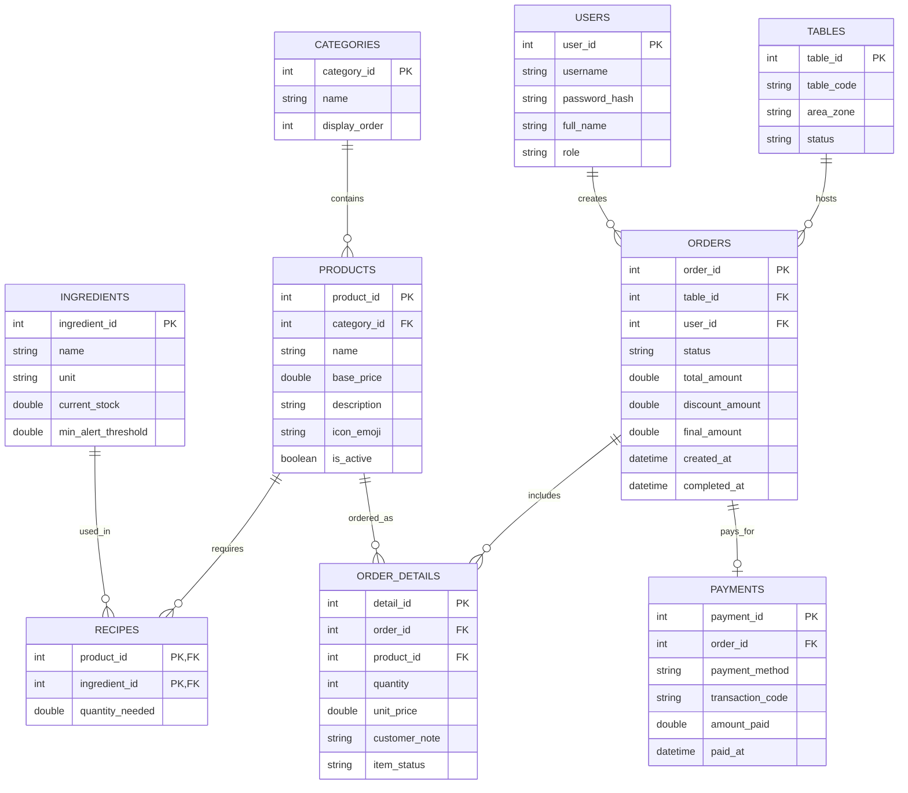

# 🏛️ TÀI LIỆU KIẾN TRÚC & KẾ HOẠCH NÂNG CẤP HỆ THỐNG CAFEORDER (GIAI ĐOẠN 3)
**Tác giả:** Principal Software Architect & Lead Java Systems Engineer  
**Phiên bản:** 3.0-ENTERPRISE  
**Mục tiêu:** Chuyển đổi CafeOrder từ một sản phẩm PoC/MVP sang Hệ thống POS & KDS Phân Tán Đạt Chuẩn Thương Mại (Production-Ready Commercial System).

---

## 🧭 I. ĐÁNH GIÁ CÔNG TÂM MỨC ĐỘ HOÀN THIỆN HIỆN TẠI (SYSTEM AUDIT)

Dưới góc nhìn của một kỹ sư 20 năm kinh nghiệm trong hệ thống doanh nghiệp (Enterprise Systems), tôi đánh giá hệ thống hiện tại đang đạt:

### 🎯 **Mức độ hoàn thiện: 42% (Proof of Concept nâng cao / MVP Giao diện)**

Dự án đã có bước nhảy vọt xuất sắc về mặt **UI/UX và cấu trúc tầng (Clean MVC)**, tuy nhiên để có thể vận hành thực tế tại một quán cà phê hoạt động 14-16 tiếng/ngày với doanh thu hàng trăm triệu mỗi tháng, hệ thống còn thiếu các cột trụ trọng yếu về **Tính bền bỉ dữ liệu (Persistence), Khả năng chịu lỗi mạng (Fault Tolerance), Bảo mật (Security) và Tự động hóa vận hành (Operations)**.

### Bảng Đánh Giá Chi Tiết Từng Phân Hệ:

| Phân hệ / Tiêu chí | Trọng số | % Đạt được | Nhận xét kiến trúc chuyên sâu |
| :--- | :---: | :---: | :--- |
| **1. UI/UX & Tương tác Kiosk/KDS** | 20% | **85%** | Giao diện JavaFX rất đẹp, hiện đại, phối màu ấm cúng chuẩn Cafe lounge. Có stepper, suggestion chips, CSS phân tách sạch sẽ. Cần thêm âm thanh (Audio Cue) và Responsive kích thước màn hình POS thực tế. |
| **2. Kiến trúc Mã nguồn (Codebase & MVC)** | 15% | **80%** | Phân tách Package chuẩn mực (`cafe.models`, `cafe.views`, `cafe.controllers`, `cafe.services`). Áp dụng Reactive Property tốt trong `CartModel`. Tách biệt Entry Point sạch sẽ. |
| **3. Tầng Dữ liệu & Lưu trữ (Persistence)** | 25% | **10%** | **Điểm yếu chí mạng:** Dữ liệu hoàn toàn nằm trên RAM (`ConcurrentHashMap`, static list). Tắt máy hoặc cúp điện là mất sạch đơn hàng, doanh thu và lịch sử order. Chưa có Database. |
| **4. Giao thức Mạng (Networking & Resilience)** | 15% | **35%** | Socket thuần chạy ổn định trong mạng LAN lý tưởng. Chưa có cơ chế Heartbeat (Ping/Pong), tự động kết nối lại (Auto-reconnect), chưa chống trùng lặp đơn khi lag mạng (Idempotency Key). |
| **5. Nghiệp vụ Quản trị (Business Logic)** | 15% | **25%** | Mới dừng ở: Chọn món ➔ Gửi order ➔ Barista bấm đổi trạng thái. Chưa có: Trừ kho nguyên liệu (Inventory), Thanh toán (QR/Tiền mặt), In bill nhiệt (Thermal Print), Hủy món/Đổi bàn. |
| **6. An toàn, Bảo mật & Báo cáo (Audit & Security)** | 10% | **5%** | Bất kỳ ai mở App đều bấm được số bàn; chưa có Role-based access control (Admin, Thu ngân, Barista). Chưa có Dashboard báo cáo doanh số, ca làm việc. |

---

## 🗄️ II. THIẾT KẾ TẦNG DỮ LIỆU TOÀN DIỆN (DATA PERSISTENCE ARCHITECTURE)

Một hệ thống F&B thực tế phải tuân thủ nghiêm ngặt tính chất **ACID (Atomicity, Consistency, Isolation, Durability)**: *Không bao giờ được mất đơn, không được tính sai tiền, và mất mạng vẫn phải bán được hàng.*

### 1. Lựa chọn Công nghệ Lưu trữ
* **Lựa chọn tối ưu:** **SQLite** kết hợp thư viện kết nối hiệu năng cao **HikariCP** (Connection Pool).
* **Lý do lựa chọn:**
  * **Zero-Configuration:** SQLite lưu trữ thành 1 file database duy nhất (`cafe_master.db`), quán không cần cài đặt MySQL/PostgreSQL phức tạp, dễ dàng sao lưu lên Cloud (Google Drive/Dropbox).
  * **Tốc độ đọc/ghi cực nhanh:** Với quy mô quán cafe (dưới 10.000 transactions/ngày), SQLite cho tốc độ truy xuất cục bộ < 1ms, vượt trội so với gọi database qua mạng.
  * **Hỗ trợ Transaction ACID đầy đủ:** Đảm bảo khi bấm "Thanh toán", việc ghi nhận đơn hàng và trừ kho nguyên liệu diễn ra trong 1 transaction duy nhất (Atomic).

### 2. Sơ đồ Thực thể Dữ liệu (Entity Relationship - ERD)



### 3. DDL Schema Chi Tiết (SQLite / H2 Dialect)

```sql
-- 1. Bảng danh mục & sản phẩm
CREATE TABLE IF NOT EXISTS categories (
    category_id INTEGER PRIMARY KEY AUTOINCREMENT,
    name TEXT NOT NULL UNIQUE,
    display_order INTEGER DEFAULT 0
);

CREATE TABLE IF NOT EXISTS products (
    product_id INTEGER PRIMARY KEY AUTOINCREMENT,
    category_id INTEGER NOT NULL,
    name TEXT NOT NULL,
    base_price REAL NOT NULL CHECK(base_price >= 0),
    description TEXT,
    icon_emoji TEXT DEFAULT '☕',
    is_active INTEGER DEFAULT 1,
    FOREIGN KEY (category_id) REFERENCES categories(category_id)
);

-- 2. Quản lý kho nguyên vật liệu & Định lượng (Recipe)
CREATE TABLE IF NOT EXISTS ingredients (
    ingredient_id INTEGER PRIMARY KEY AUTOINCREMENT,
    name TEXT NOT NULL,
    unit TEXT NOT NULL, -- 'gram', 'ml', 'cai'
    current_stock REAL NOT NULL DEFAULT 0,
    min_alert_threshold REAL NOT NULL DEFAULT 10
);

CREATE TABLE IF NOT EXISTS recipes (
    product_id INTEGER NOT NULL,
    ingredient_id INTEGER NOT NULL,
    quantity_needed REAL NOT NULL,
    PRIMARY KEY (product_id, ingredient_id),
    FOREIGN KEY (product_id) REFERENCES products(product_id),
    FOREIGN KEY (ingredient_id) REFERENCES ingredients(ingredient_id)
);

-- 3. Quản lý bàn & Hóa đơn đơn hàng
CREATE TABLE IF NOT EXISTS tables (
    table_id INTEGER PRIMARY KEY AUTOINCREMENT,
    table_number INTEGER NOT NULL UNIQUE,
    area_zone TEXT DEFAULT 'Tầng 1', -- 'Tầng 1', 'Sân Vườn', 'Phòng Lạnh'
    status TEXT DEFAULT 'AVAILABLE'  -- 'AVAILABLE', 'OCCUPIED', 'RESERVED'
);

CREATE TABLE IF NOT EXISTS orders (
    order_id INTEGER PRIMARY KEY AUTOINCREMENT,
    table_id INTEGER NOT NULL,
    status TEXT NOT NULL DEFAULT 'QUEUED', -- 'QUEUED', 'PREPARING', 'DONE', 'PAID', 'CANCELLED'
    total_amount REAL NOT NULL DEFAULT 0,
    created_at TIMESTAMP DEFAULT CURRENT_TIMESTAMP,
    completed_at TIMESTAMP NULL,
    idempotency_key TEXT UNIQUE, -- Chống gửi đơn trùng lặp
    FOREIGN KEY (table_id) REFERENCES tables(table_id)
);

CREATE TABLE IF NOT EXISTS order_details (
    detail_id INTEGER PRIMARY KEY AUTOINCREMENT,
    order_id INTEGER NOT NULL,
    product_id INTEGER NOT NULL,
    quantity INTEGER NOT NULL CHECK(quantity > 0),
    unit_price REAL NOT NULL,
    customer_note TEXT,
    FOREIGN KEY (order_id) REFERENCES orders(order_id),
    FOREIGN KEY (product_id) REFERENCES products(product_id)
);

-- 4. Thanh toán & Giao dịch
CREATE TABLE IF NOT EXISTS payments (
    payment_id INTEGER PRIMARY KEY AUTOINCREMENT,
    order_id INTEGER NOT NULL UNIQUE,
    payment_method TEXT NOT NULL, -- 'CASH', 'VIETQR', 'MOMO', 'CARD'
    transaction_code TEXT,
    amount_paid REAL NOT NULL,
    paid_at TIMESTAMP DEFAULT CURRENT_TIMESTAMP,
    FOREIGN KEY (order_id) REFERENCES orders(order_id)
);
```

### 4. Cơ Chế Kết Nối & Quản Lý Connection (DAO & Pool Pattern)

```text
[JavaFX Controllers / Services]
              │
              ▼
[OrderRepository / ProductRepository]  (DAO Interface)
              │
              ▼
[HikariCP Connection Pool] (Quản lý 10-20 kết nối sẵn sàng)
              │
              ▼
[SQLite JDBC Driver (WAL Mode - Write-Ahead Logging)]
              │
              ▼
[cafe_master.db (File cục bộ trên Server)]
```

* **Chế độ WAL (Write-Ahead Logging):** Kích hoạt `PRAGMA journal_mode=WAL;` cho phép nhiều luồng Client đọc song song (Concurrent Reads) trong khi luồng Server ghi đơn mà không bao giờ bị khóa database (`SQLITE_BUSY`).
* **Connection Pool:** Sử dụng `com.zaxxer.hikari.HikariDataSource` tối ưu tài nguyên RAM và luồng.

---

## 💡 III. CÁC TÍNH NĂNG MỚI, SÁNG TẠO & ĐỘT PHÁ CHO GIAI ĐOẠN 3

### 1. Smart KDS: Điều Phối Pha Chế Thông Minh (Intelligent Barista Assistance)
* **Auto-Batching (Gom món thông minh):** Nếu Bàn 1 gọi 2 ly Bạc xỉu và Bàn 3 gọi 2 ly Bạc xỉu trong vòng 5 phút, KDS tự động làm nổi bật huy hiệu: *"Gom pha: 4x Bạc xỉu"*, giúp Barista đánh sữa một lần cho cả 4 ly, tiết kiệm 40% thời gian chuẩn bị.
* **Overdue Alert & Pulsing SLA (Cảnh báo trễ hạn):**
  * Đơn chờ < 5 phút: Viền xanh xám bình thường.
  * Đơn chờ 5 - 10 phút: Viền chuyển vàng hổ phách nhấp nháy.
  * Đơn chờ > 15 phút: Viền đỏ đậm, phát chuông cảnh báo âm thanh `alert_overdue.wav` để Barista ưu tiên phục vụ ngay.
* **Âm thanh thực tế:** Tích hợp âm thanh khi có order mới (`ding_order.wav`) và khi thanh toán xong (`cash_register.wav`).

### 2. Tự Động Trừ Kho Nguyên Vật Liệu (Real-time Inventory Deduction)
* **Cơ chế:** Khi Barista bấm **"✓ HOÀN TẤT & GỬI BÀN"**, Transaction DB kích hoạt:
  $$\text{Tồn kho mới} = \text{Tồn kho hiện tại} - (\text{Định lượng món} \times \text{Số lượng})$$
* **Hết hàng tự động (Auto Out-of-Stock):** Khi nguyên liệu sữa đặc trong kho giảm xuống dưới mức tối thiểu (ví dụ < 200g), toàn bộ các món sử dụng sữa đặc trên màn hình Kiosk của khách tự động đổi sang trạng thái làm mờ (Disabled) kèm nhãn *"Tạm hết món"*, ngăn chặn việc khách đặt món mà quầy không thể phục vụ.

### 3. Thanh Toán QR Động Thời Gian Thực (Dynamic VietQR / MoMo Push Notification)
* **Quy trình:**
  1. Khách bấm nút **"THANH TOÁN TẠI BÀN"** trên Kiosk.
  2. Hệ thống sinh ngay mã QR Napas 24/7 (VietQR API) hiển thị trên màn hình với:
     * *Số tài khoản ngân hàng quán*
     * *Đúng số tiền cần trả* (ví dụ: `87.000 đ`)
     * *Nội dung chuyển khoản chuẩn hóa:* `BAN03 HD1005`
  3. Khi tiền vào tài khoản (thông qua Webhook ngân hàng hoặc Barista xác nhận trên KDS), màn hình Kiosk tự động phát hiệu ứng pháo hoa, đổi trạng thái sang *"Đã thanh toán thành công"* và in hóa đơn.

### 4. Tự Động Kết Nối Lại & Khả Năng Hoạt Động Offline (Self-Healing Socket Mesh)
* **Heartbeat Ping/Pong:** Cứ mỗi 5 giây, Client và Server gửi gói tin nhịp tim `PING` - `PONG`. Nếu mất kết nối trong 3 chu kỳ, Client tự động chuyển sang chế độ Reconnecting với thuật toán *Exponential Backoff* (1s, 2s, 4s, 8s...).
* **Local Offline Queue:** Trong lúc mất mạng LAN, khách vẫn có thể chọn món. Giỏ hàng được lưu tạm vào bộ nhớ đệm cục bộ; ngay khi mạng kết nối lại, đơn sẽ tự động bắn lên Server mà không bị mất.
* **Idempotency Key (Chống lặp đơn):** Mỗi order sinh một mã UUID duy nhất. Nếu mạng giật làm gửi 2 lần, Server chỉ tiếp nhận 1 lần duy nhất.

### 5. Bảng Điều Khiển Quản Trị & Báo Cáo Doanh Thu (Executive BI Dashboard)
* **Báo cáo cuối ngày (Z-Report):** Một cửa sổ Dashboard riêng dành cho Chủ quán:
  * Doanh thu theo ngày/tuần/tháng (vẽ biểu đồ đường JavaFX Charts).
  * Biểu đồ tròn phân tích: 80/20 món mang lại doanh số cao nhất.
  * Thống kê khung giờ vàng (Peak-hour Heatmap) để sắp xếp nhân sự quầy.
  * Xuất báo cáo ra định dạng file Excel (`.xlsx`) hoặc PDF.

---

## 🗺️ IV. LỘ TRÌNH TRIỂN KHAI CHI TIẾT (IMPLEMENTATION ROADMAP)

```text
[Sprint 1: Database & Persistence] ➔ [Sprint 2: Socket Fault-Tolerance] ➔ [Sprint 3: Kho & Thanh Toán] ➔ [Sprint 4: KDS Thông Minh & Báo Cáo]
```

### Giai đoạn 3.1: Hoàn thiện Tầng Dữ Liệu & Repository Pattern (Tuần 1)
* [x] Tạo file tài liệu nâng cấp kiến trúc [`UPGRADE_PLAN_GIAIDOAN3.md`](file:///C:/Users/ACER/Documents/NetBeansProjects/CafeOrder/UPGRADE_PLAN_GIAIDOAN3.md).
* [ ] Tích hợp thư viện `sqlite-jdbc` và `HikariCP` vào thư mục `lib/`.
* [ ] Thiết lập lớp `DatabaseManager` quản lý kết nối và tự động khởi chạy Schema DDL.
* [ ] Xây dựng các DAO: `ProductDAO`, `OrderDAO`, `InventoryDAO`.
* [ ] Chuyển đổi dữ liệu `MenuRepository` từ Mock tĩnh sang đọc/ghi từ Database.

### Giai đoạn 3.2: Tối ưu Socket, Heartbeat & Kháng Lỗi (Tuần 2)
* [ ] Bổ sung mã `PING`/`PONG` vào `MessageProtocol`.
* [ ] Cài đặt bộ đếm giờ tự động kết nối lại trên `ClientSocketService`.
* [ ] Thêm UUID Idempotency Key vào gói tin `NEW_ORDER`.

### Giai đoạn 3.3: Nghiệp Vụ Kho & Tích Hợp VietQR (Tuần 3)
* [ ] Xây dựng Transaction trừ kho tự động khi hoàn tất đơn.
* [ ] Tích hợp API tạo mã QR thanh toán động VietQR hiển thị trực tiếp trên Kiosk.
* [ ] Thêm popup xác nhận thanh toán tiền mặt/chuyển khoản trên màn hình KDS.

### Giai đoạn 3.4: KDS Âm Thanh & Bảng Thống Kê Dashboard (Tuần 4)
* [ ] Tích hợp hiệu ứng âm thanh JavaFX Audio (`ding_order.wav`, `alert_overdue.wav`).
* [ ] Xây dựng màn hình `AdminDashboardView` với JavaFX LineChart & PieChart.
* [ ] Kiểm thử chịu tải (Stress testing) đồng thời 20 bàn đặt món liên tục.

---

## 🎯 V. KẾT LUẬN & ĐỀ XUẤT CỦA ARCHITECT

Hệ thống hiện tại của bạn đã sở hữu **giao diện rất xuất sắc và nền tảng MVC chuẩn mực**. Việc tập trung vào **Giai đoạn 3** với trọng tâm là **Database SQLite + Trừ kho + Thanh toán QR** sẽ biến CafeOrder từ một đồ án/dự án thử nghiệm thành một **phần mềm có giá trị thương mại thực tế cao**, đủ năng lực triển khai vận hành trực tiếp cho bất kỳ chuỗi cửa hàng cà phê nào.
