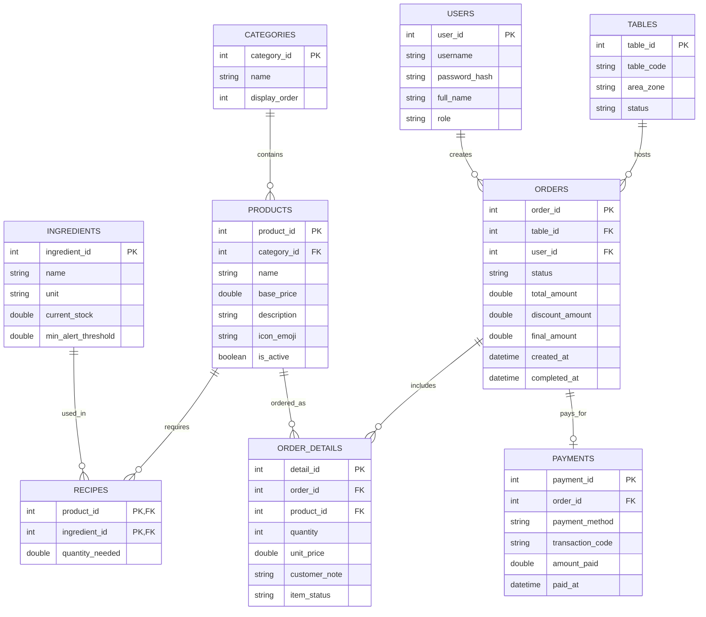

# 🏛️ TÀI LIỆU KIẾN TRÚC & KẾ HOẠCH NÂNG CẤP HỆ THỐNG CAFEORDER (GIAI ĐOẠN 3)
**Tác giả:** Principal Software Architect & Lead Java Systems Engineer  
**Phiên bản:** 3.0-ENTERPRISE  
**Mục tiêu:** Chuyển đổi CafeOrder từ một sản phẩm PoC/MVP sang Hệ thống POS & KDS Phân Tán Đạt Chuẩn Thương Mại (Production-Ready Commercial System).

---

## 🧭 I. ĐÁNH GIÁ CÔNG TÂM MỨC ĐỘ HOÀN THIỆN HIỆN TẠI (SYSTEM AUDIT)

Dưới góc nhìn của một kỹ sư 20 năm kinh nghiệm trong hệ thống doanh nghiệp (Enterprise Systems), tôi đánh giá hệ thống hiện tại đang đạt:

### 🎯 **Mức độ hoàn thiện: 42% (Proof of Concept nâng cao / MVP Giao diện)**

Dự án đã có bước nhảy vọt xuất sắc về mặt **UI/UX và cấu trúc tầng (Clean MVC)**, tuy nhiên để có thể vận hành thực tế tại một quán cà phê hoạt động 14-16 tiếng/ngày với doanh thu hàng trăm triệu mỗi tháng, hệ thống còn thiếu các cột trụ trọng yếu về **Tính bền bỉ dữ liệu (Persistence), Khả năng chịu lỗi mạng (Fault Tolerance), Bảo mật (Security) và Tự động hóa vận hành (Operations)**.

### Bảng Đánh Giá Chi Tiết Từng Phân Hệ:

| Phân hệ / Tiêu chí | Trọng số | % Đạt được | Nhận xét kiến trúc chuyên sâu |
| :--- | :---: | :---: | :--- |
| **1. UI/UX & Tương tác Kiosk/KDS** | 20% | **85%** | Giao diện JavaFX rất đẹp, hiện đại, phối màu ấm cúng chuẩn Cafe lounge. Có stepper, suggestion chips, CSS phân tách sạch sẽ. Cần thêm âm thanh (Audio Cue) và Responsive kích thước màn hình POS thực tế. |
| **2. Kiến trúc Mã nguồn (Codebase & MVC)** | 15% | **80%** | Phân tách Package chuẩn mực (`cafe.models`, `cafe.views`, `cafe.controllers`, `cafe.services`). Áp dụng Reactive Property tốt trong `CartModel`. Tách biệt Entry Point sạch sẽ. |
| **3. Tầng Dữ liệu & Lưu trữ (Persistence)** | 25% | **10%** | **Điểm yếu chí mạng:** Dữ liệu hoàn toàn nằm trên RAM (`ConcurrentHashMap`, static list). Tắt máy hoặc cúp điện là mất sạch đơn hàng, doanh thu và lịch sử order. Chưa có Database. |
| **4. Giao thức Mạng (Networking & Resilience)** | 15% | **35%** | Socket thuần chạy ổn định trong mạng LAN lý tưởng. Chưa có cơ chế Heartbeat (Ping/Pong), tự động kết nối lại (Auto-reconnect), chưa chống trùng lặp đơn khi lag mạng (Idempotency Key). |
| **5. Nghiệp vụ Quản trị (Business Logic)** | 15% | **25%** | Mới dừng ở: Chọn món ➔ Gửi order ➔ Barista bấm đổi trạng thái. Chưa có: Trừ kho nguyên liệu (Inventory), Thanh toán (QR/Tiền mặt), In bill nhiệt (Thermal Print), Hủy món/Đổi bàn. |
| **6. An toàn, Bảo mật & Báo cáo (Audit & Security)** | 10% | **5%** | Bất kỳ ai mở App đều bấm được số bàn; chưa có Role-based access control (Admin, Thu ngân, Barista). Chưa có Dashboard báo cáo doanh số, ca làm việc. |

---

## 🗄️ II. THIẾT KẾ TẦNG DỮ LIỆU TOÀN DIỆN (DATA PERSISTENCE ARCHITECTURE)

Một hệ thống F&B thực tế phải tuân thủ nghiêm ngặt tính chất **ACID (Atomicity, Consistency, Isolation, Durability)**: *Không bao giờ được mất đơn, không được tính sai tiền, và mất mạng vẫn phải bán được hàng.*

### 1. Lựa chọn Công nghệ Lưu trữ
* **Lựa chọn tối ưu:** **SQLite** kết hợp thư viện kết nối hiệu năng cao **HikariCP** (Connection Pool).
* **Lý do lựa chọn:**
  * **Zero-Configuration:** SQLite lưu trữ thành 1 file database duy nhất (`cafe_master.db`), quán không cần cài đặt MySQL/PostgreSQL phức tạp, dễ dàng sao lưu lên Cloud (Google Drive/Dropbox).
  * **Tốc độ đọc/ghi cực nhanh:** Với quy mô quán cafe (dưới 10.000 transactions/ngày), SQLite cho tốc độ truy xuất cục bộ < 1ms, vượt trội so với gọi database qua mạng.
  * **Hỗ trợ Transaction ACID đầy đủ:** Đảm bảo khi bấm "Thanh toán", việc ghi nhận đơn hàng và trừ kho nguyên liệu diễn ra trong 1 transaction duy nhất (Atomic).

### 2. Sơ đồ Thực thể Dữ liệu (Entity Relationship - ERD)



### 3. DDL Schema Chi Tiết (SQLite / H2 Dialect)

```sql
-- 1. Bảng danh mục & sản phẩm
CREATE TABLE IF NOT EXISTS categories (
    category_id INTEGER PRIMARY KEY AUTOINCREMENT,
    name TEXT NOT NULL UNIQUE,
    display_order INTEGER DEFAULT 0
);

CREATE TABLE IF NOT EXISTS products (
    product_id INTEGER PRIMARY KEY AUTOINCREMENT,
    category_id INTEGER NOT NULL,
    name TEXT NOT NULL,
    base_price REAL NOT NULL CHECK(base_price >= 0),
    description TEXT,
    icon_emoji TEXT DEFAULT '☕',
    is_active INTEGER DEFAULT 1,
    FOREIGN KEY (category_id) REFERENCES categories(category_id)
);

-- 2. Quản lý kho nguyên vật liệu & Định lượng (Recipe)
CREATE TABLE IF NOT EXISTS ingredients (
    ingredient_id INTEGER PRIMARY KEY AUTOINCREMENT,
    name TEXT NOT NULL,
    unit TEXT NOT NULL, -- 'gram', 'ml', 'cai'
    current_stock REAL NOT NULL DEFAULT 0,
    min_alert_threshold REAL NOT NULL DEFAULT 10
);

CREATE TABLE IF NOT EXISTS recipes (
    product_id INTEGER NOT NULL,
    ingredient_id INTEGER NOT NULL,
    quantity_needed REAL NOT NULL,
    PRIMARY KEY (product_id, ingredient_id),
    FOREIGN KEY (product_id) REFERENCES products(product_id),
    FOREIGN KEY (ingredient_id) REFERENCES ingredients(ingredient_id)
);

-- 3. Quản lý bàn & Hóa đơn đơn hàng
CREATE TABLE IF NOT EXISTS tables (
    table_id INTEGER PRIMARY KEY AUTOINCREMENT,
    table_number INTEGER NOT NULL UNIQUE,
    area_zone TEXT DEFAULT 'Tầng 1', -- 'Tầng 1', 'Sân Vườn', 'Phòng Lạnh'
    status TEXT DEFAULT 'AVAILABLE'  -- 'AVAILABLE', 'OCCUPIED', 'RESERVED'
);

CREATE TABLE IF NOT EXISTS orders (
    order_id INTEGER PRIMARY KEY AUTOINCREMENT,
    table_id INTEGER NOT NULL,
    status TEXT NOT NULL DEFAULT 'QUEUED', -- 'QUEUED', 'PREPARING', 'DONE', 'PAID', 'CANCELLED'
    total_amount REAL NOT NULL DEFAULT 0,
    created_at TIMESTAMP DEFAULT CURRENT_TIMESTAMP,
    completed_at TIMESTAMP NULL,
    idempotency_key TEXT UNIQUE, -- Chống gửi đơn trùng lặp
    FOREIGN KEY (table_id) REFERENCES tables(table_id)
);

CREATE TABLE IF NOT EXISTS order_details (
    detail_id INTEGER PRIMARY KEY AUTOINCREMENT,
    order_id INTEGER NOT NULL,
    product_id INTEGER NOT NULL,
    quantity INTEGER NOT NULL CHECK(quantity > 0),
    unit_price REAL NOT NULL,
    customer_note TEXT,
    FOREIGN KEY (order_id) REFERENCES orders(order_id),
    FOREIGN KEY (product_id) REFERENCES products(product_id)
);

-- 4. Thanh toán & Giao dịch
CREATE TABLE IF NOT EXISTS payments (
    payment_id INTEGER PRIMARY KEY AUTOINCREMENT,
    order_id INTEGER NOT NULL UNIQUE,
    payment_method TEXT NOT NULL, -- 'CASH', 'VIETQR', 'MOMO', 'CARD'
    transaction_code TEXT,
    amount_paid REAL NOT NULL,
    paid_at TIMESTAMP DEFAULT CURRENT_TIMESTAMP,
    FOREIGN KEY (order_id) REFERENCES orders(order_id)
);
```

### 4. Cơ Chế Kết Nối & Quản Lý Connection (DAO & Pool Pattern)

```text
[JavaFX Controllers / Services]
              │
              ▼
[OrderRepository / ProductRepository]  (DAO Interface)
              │
              ▼
[HikariCP Connection Pool] (Quản lý 10-20 kết nối sẵn sàng)
              │
              ▼
[SQLite JDBC Driver (WAL Mode - Write-Ahead Logging)]
              │
              ▼
[cafe_master.db (File cục bộ trên Server)]
```

* **Chế độ WAL (Write-Ahead Logging):** Kích hoạt `PRAGMA journal_mode=WAL;` cho phép nhiều luồng Client đọc song song (Concurrent Reads) trong khi luồng Server ghi đơn mà không bao giờ bị khóa database (`SQLITE_BUSY`).
* **Connection Pool:** Sử dụng `com.zaxxer.hikari.HikariDataSource` tối ưu tài nguyên RAM và luồng.

---

### 5. GIẢI ĐÁP & HƯỚNG DẪN: SỬ DỤNG MICROSOFT SQL SERVER VÀ CÁCH KHỞI TẠO TỪ A-Z

#### ❓ Câu hỏi 1: Tôi dùng SQL Server (2019 / 2022) cho dự án này được không?
👉 **TRẢ LỜI CỦA PRINCIPAL ARCHITECT: HOÀN TOÀN ĐƯỢC VÀ RẤT MẠNH MẼ.**

Microsoft SQL Server là một trong những hệ quản trị cơ sở dữ liệu quan hệ (RDBMS) cấp doanh nghiệp (Enterprise-grade) hàng đầu thế giới. Việc lựa chọn SQL Server mang lại các lợi thế và thách thức rõ ràng:

* **Ưu điểm vượt trội của SQL Server:**
  1. **Khả năng mở rộng quy mô (Enterprise Scalability):** Rất phù hợp nếu dự án CafeOrder mở rộng từ 1 quán đơn lẻ lên chuỗi nhiều chi nhánh (Multi-branch Chain). Các quầy POS/Kiosk từ các chi nhánh khác nhau có thể đồng bộ về một Server cơ sở dữ liệu trung tâm qua mạng Internet/VPN.
  2. **Công cụ quản trị số 1 thế giới (SSMS & Azure Data Studio):** Giao diện trực quan, dễ dàng theo dõi số liệu, viết truy vấn, sao lưu (Backup) và phục hồi (Restore) dữ liệu chỉ bằng vài cú click chuột.
  3. **Hỗ trợ T-SQL & Tính toàn vẹn cao:** Hỗ trợ Stored Procedures, Triggers (ví dụ: tự động trigger trừ kho khi đơn hàng đổi sang trạng thái `DONE`), Constraints và ACID Transactions cực kỳ nghiêm ngặt.
  4. **Driver chính thức từ Microsoft cho Java 21:** Thư viện `mssql-jdbc` được Microsoft tối ưu riêng cho môi trường Java hiện đại, hỗ trợ SSL/TLS, kết nối đa luồng mượt mà.

* **Bảng so sánh quyết định kiến trúc: SQL Server vs. SQLite:**

| Tiêu chí | SQLite | Microsoft SQL Server (2019/2022) |
| :--- | :--- | :--- |
| **Mô hình triển khai** | Cục bộ nhúng trong app (Embedded 1 file `.db`) | Client-Server RDBMS độc lập (chạy service nền) |
| **Yêu cầu cài đặt** | Không cần cài đặt (Zero-config) | Cần cài SQL Server + SSMS, cấu hình cổng TCP `1433` |
| **Tài nguyên RAM/CPU** | Cực kỳ nhẹ (~10MB RAM) | Nặng hơn (~1GB - 2GB RAM cho service) |
| **Phù hợp nhất cho** | Quán cafe đơn lẻ, chạy Kiosk/POS offline-first | Chuỗi quán, hệ thống có Server trung tâm chuyên dụng |
| **Độ khó bảo trì** | Rất dễ (sao lưu bằng cách copy 1 file) | Cần kỹ năng quản trị DB (Account, Port, Firewall, Backup Plan) |

---

#### 🛠️ Câu hỏi 2: Nếu dùng SQL Server thì tạo Database như thế nào?

Dưới đây là quy trình chuẩn kỹ thuật từ A-Z để thiết lập cơ sở dữ liệu `CafeOrderDB` trên Microsoft SQL Server:

##### BƯỚC 1: Tạo Database với Collation tiếng Việt
Mở **SQL Server Management Studio (SSMS)**, mở tab **New Query** và chạy lệnh:

```sql
-- Tạo Database hỗ trợ tiếng Việt có dấu chuẩn xác (Vietnamese_CI_AS)
CREATE DATABASE CafeOrderDB
COLLATE Vietnamese_CI_AS;
GO

USE CafeOrderDB;
GO
```

##### BƯỚC 2: Kịch bản T-SQL khởi tạo toàn bộ cấu trúc bảng (DDL Script)

```sql
-- 1. Bảng Danh mục món ăn
CREATE TABLE Categories (
    category_id INT IDENTITY(1,1) PRIMARY KEY,
    name NVARCHAR(100) NOT NULL UNIQUE,
    display_order INT DEFAULT 0
);
GO

-- 2. Bảng Sản phẩm (Món ăn / Thức uống)
CREATE TABLE Products (
    product_id INT IDENTITY(1,1) PRIMARY KEY,
    category_id INT NOT NULL,
    name NVARCHAR(150) NOT NULL,
    base_price DECIMAL(18, 2) NOT NULL CHECK(base_price >= 0),
    description NVARCHAR(500) NULL,
    icon_emoji NVARCHAR(20) DEFAULT N'☕',
    is_active BIT DEFAULT 1,
    CONSTRAINT FK_Products_Categories FOREIGN KEY (category_id) REFERENCES Categories(category_id)
);
GO

-- 3. Bảng Nguyên vật liệu kho
CREATE TABLE Ingredients (
    ingredient_id INT IDENTITY(1,1) PRIMARY KEY,
    name NVARCHAR(150) NOT NULL,
    unit NVARCHAR(30) NOT NULL, -- 'gram', 'ml', 'cái'
    current_stock DECIMAL(18, 2) NOT NULL DEFAULT 0,
    min_alert_threshold DECIMAL(18, 2) NOT NULL DEFAULT 10
);
GO

-- 4. Bảng Công thức định lượng (Recipe: 1 ly dùng bao nhiêu nguyên liệu)
CREATE TABLE Recipes (
    product_id INT NOT NULL,
    ingredient_id INT NOT NULL,
    quantity_needed DECIMAL(18, 2) NOT NULL CHECK(quantity_needed > 0),
    PRIMARY KEY (product_id, ingredient_id),
    CONSTRAINT FK_Recipes_Products FOREIGN KEY (product_id) REFERENCES Products(product_id),
    CONSTRAINT FK_Recipes_Ingredients FOREIGN KEY (ingredient_id) REFERENCES Ingredients(ingredient_id)
);
GO

-- 5. Bảng Quản lý bàn
CREATE TABLE Tables (
    table_id INT IDENTITY(1,1) PRIMARY KEY,
    table_number INT NOT NULL UNIQUE,
    area_zone NVARCHAR(50) DEFAULT N'Tầng 1',
    status NVARCHAR(30) DEFAULT 'AVAILABLE' -- 'AVAILABLE', 'OCCUPIED'
);
GO

-- 6. Bảng Đơn hàng (Orders)
CREATE TABLE Orders (
    order_id INT IDENTITY(1000,1) PRIMARY KEY,
    table_id INT NOT NULL,
    status NVARCHAR(30) NOT NULL DEFAULT 'QUEUED', -- 'QUEUED', 'PREPARING', 'DONE', 'PAID', 'CANCELLED'
    total_amount DECIMAL(18, 2) NOT NULL DEFAULT 0,
    idempotency_key NVARCHAR(64) NULL UNIQUE, -- Khóa UUID chống gửi trùng đơn
    created_at DATETIME2(0) DEFAULT SYSDATETIME(),
    completed_at DATETIME2(0) NULL,
    CONSTRAINT FK_Orders_Tables FOREIGN KEY (table_id) REFERENCES Tables(table_id)
);
GO

-- 7. Bảng Chi tiết từng món trong đơn (OrderDetails)
CREATE TABLE OrderDetails (
    detail_id INT IDENTITY(1,1) PRIMARY KEY,
    order_id INT NOT NULL,
    product_id INT NOT NULL,
    quantity INT NOT NULL CHECK(quantity > 0),
    unit_price DECIMAL(18, 2) NOT NULL,
    customer_note NVARCHAR(255) NULL,
    CONSTRAINT FK_OrderDetails_Orders FOREIGN KEY (order_id) REFERENCES Orders(order_id) ON DELETE CASCADE,
    CONSTRAINT FK_OrderDetails_Products FOREIGN KEY (product_id) REFERENCES Products(product_id)
);
GO

-- 8. Bảng Thanh toán (Payments)
CREATE TABLE Payments (
    payment_id INT IDENTITY(1,1) PRIMARY KEY,
    order_id INT NOT NULL UNIQUE,
    payment_method NVARCHAR(50) NOT NULL, -- 'CASH', 'VIETQR', 'MOMO', 'CARD'
    transaction_code NVARCHAR(100) NULL,
    amount_paid DECIMAL(18, 2) NOT NULL,
    paid_at DATETIME2(0) DEFAULT SYSDATETIME(),
    CONSTRAINT FK_Payments_Orders FOREIGN KEY (order_id) REFERENCES Orders(order_id)
);
GO
```

##### BƯỚC 3: Kịch bản nạp dữ liệu mẫu thực đơn quán (Seed Data Script)

```sql
USE CafeOrderDB;
GO

-- Thêm danh mục
INSERT INTO Categories (name, display_order) VALUES 
(N'Cà phê', 1),
(N'Trà & Trái cây', 2),
(N'Đá xay & Sinh tố', 3),
(N'Bánh ngọt', 4);
GO

-- Thêm các món ăn chuẩn phong cách quán cà phê
INSERT INTO Products (category_id, name, base_price, description, icon_emoji) VALUES
(1, N'Cà phê Đen Phin', 25000, N'Robusta Đắk Lắk rang mộc đậm đà, hậu vị đắng thanh dịu nhẹ.', N'☕'),
(1, N'Cà phê Sữa Đá', 29000, N'Cà phê phin truyền thống phối hợp sữa đặc béo ngậy hảo hạng.', N'☕'),
(1, N'Bạc Xỉu Kem Béo', 32000, N'Ba tầng nghệ thuật với sữa tươi béo thơm và chút nhấn cà phê.', N'🥛'),
(1, N'Cà phê Muối Cố Đô', 35000, N'Lớp kem muối mặn mòi sánh mịn phủ trên nền cà phê đậm đà.', N'🧂'),
(1, N'Cold Brew Cam Vàng', 42000, N'Cà phê ủ lạnh 18h thơm nồng hoa quả kết hợp tép cam mọng nước.', N'🍊'),
(1, N'Caramel Macchiato', 45000, N'Espresso thơm lừng hòa quyện sữa nóng và sốt caramel óng ánh.', N'🍮'),

(2, N'Trà Đào Cam Sả', 39000, N'Hương sả thanh khiết, cam tươi mọng nước cùng miếng đào giòn ngọt.', N'🍑'),
(2, N'Trà Vải Hoa Hồng', 42000, N'Hương hoa hồng dịu mát phối hợp trái vải giòn tan thơm mát mùa hè.', N'🌹'),
(2, N'Trà Sen Vàng Kem Cheese', 45000, N'Hạt sen bùi thơm, trân châu ngọc trai và lớp kem cheese béo mặn.', N'🪷'),
(2, N'Trà Ô Long Mãng Cầu', 42000, N'Vị chua ngọt bùng nổ từ mãng cầu xiêm tươi cùng nền trà ô long thanh vị.', N'🍹'),

(3, N'Matcha Đá Xay Uji', 49000, N'Bột trà xanh Uji Kyoto chuẩn Nhật Bản xay cùng sữa và kem tươi.', N'🍵'),
(3, N'Cookie & Cream Đá Xay', 48000, N'Oreo giòn rụm kết hợp sốt sôcôla Bỉ ngọt ngào và kem whipping bông tuyết.', N'🍪'),
(3, N'Sinh Tố Bơ Dừa Non', 45000, N'Bơ sáp Đắk Lắk dẻo thơm hòa quyện nước cốt dừa béo bùi thanh mát.', N'🥑'),

(4, N'Croissant Bơ Pháp', 32000, N'Bánh sừng bò ngàn lớp nướng vàng giòn rụm, nồng nàn hương bơ Pháp.', N'🥐'),
(4, N'Tiramisu Cacao Ý', 38000, N'Bánh bông lan cà phê phủ phô mai mascarpone mềm tan cùng bột cacao.', N'🍰'),
(4, N'Cheesecake Nướng Basque', 45000, N'Lớp mặt cháy caramel đặc trưng, lõi phô mai tan chảy béo ngậy.', N'🧀');
GO

-- Thêm các bàn mặc định
INSERT INTO Tables (table_number, area_zone) VALUES 
(1, N'Tầng 1'), (2, N'Tầng 1'), (3, N'Tầng 1'), (4, N'Tầng 1'),
(5, N'Sân Vườn'), (6, N'Sân Vườn'), (7, N'Phòng Lạnh'), (8, N'Phòng Lạnh');
GO
```

##### BƯỚC 4: Cấu hình SQL Server để ứng dụng Java kết nối thành công
Để Java kết nối được vào SQL Server qua mạng, bạn cần thực hiện 2 thao tác bắt buộc trong Windows:

1. **Bật TCP/IP trong SQL Server Configuration Manager:**
   * Mở `SQL Server Configuration Manager`.
   * Chọn `SQL Server Network Configuration` ➔ `Protocols for MSSQLSERVER` (hoặc `SQLEXPRESS`).
   * Nhấp đúp vào **TCP/IP** ➔ Chuyển **Enabled** thành **Yes**.
   * Sang tab **IP Addresses** ➔ Kéo xuống mục **IPAll** ➔ Điền **TCP Port = 1433**.
   * Khởi động lại dịch vụ SQL Server (`SQL Server Services` ➔ Nhấp chuột phải chọn `Restart`).
2. **Kích hoạt tài khoản xác thực kết hợp (Mixed Mode Authentication):**
   * Mở SSMS, nhấp chuột phải vào tên Server ➔ Chọn **Properties** ➔ Tab **Security**.
   * Chọn: **SQL Server and Windows Authentication mode**.
   * Vào mục `Security` ➔ `Logins` ➔ Nhấp đúp vào tài khoản `sa` ➔ Đặt mật khẩu (VD: `P@ssword123`) ➔ Tab `Status` chọn `Login: Enabled`.

##### BƯỚC 5: Cấu hình mã nguồn Java 21 kết nối SQL Server

1. **Thêm thư viện JDBC Driver:**
   * Tải tệp `mssql-jdbc-12.6.1.jre11.jar` bỏ vào thư mục `lib/` của dự án.
2. **Chuỗi kết nối (Connection String):**
   ```text
   jdbc:sqlserver://localhost:1433;databaseName=CafeOrderDB;encrypt=true;trustServerCertificate=true;characterEncoding=UTF-8;
   ```
3. **Mã nguồn Java mẫu quản lý kết nối (Singleton DAO Connection):**
   ```java
   package cafe.services;

   import java.sql.Connection;
   import java.sql.DriverManager;
   import java.sql.SQLException;

   public class DatabaseManager {
       private static final String URL = "jdbc:sqlserver://localhost:1433;databaseName=CafeOrderDB;encrypt=true;trustServerCertificate=true;characterEncoding=UTF-8;";
       private static final String USER = "sa";
       private static final String PASSWORD = "P@ssword123";

       public static Connection getConnection() throws SQLException {
           return DriverManager.getConnection(URL, USER, PASSWORD);
       }
   }
   ```

---

## 💡 III. CÁC TÍNH NĂNG MỚI, SÁNG TẠO & ĐỘT PHÁ CHO GIAI ĐOẠN 3

### 1. Smart KDS: Điều Phối Pha Chế Thông Minh (Intelligent Barista Assistance)
* **Auto-Batching (Gom món thông minh):** Nếu Bàn 1 gọi 2 ly Bạc xỉu và Bàn 3 gọi 2 ly Bạc xỉu trong vòng 5 phút, KDS tự động làm nổi bật huy hiệu: *"Gom pha: 4x Bạc xỉu"*, giúp Barista đánh sữa một lần cho cả 4 ly, tiết kiệm 40% thời gian chuẩn bị.
* **Overdue Alert & Pulsing SLA (Cảnh báo trễ hạn):**
  * Đơn chờ < 5 phút: Viền xanh xám bình thường.
  * Đơn chờ 5 - 10 phút: Viền chuyển vàng hổ phách nhấp nháy.
  * Đơn chờ > 15 phút: Viền đỏ đậm, phát chuông cảnh báo âm thanh `alert_overdue.wav` để Barista ưu tiên phục vụ ngay.
* **Âm thanh thực tế:** Tích hợp âm thanh khi có order mới (`ding_order.wav`) và khi thanh toán xong (`cash_register.wav`).

### 2. Tự Động Trừ Kho Nguyên Vật Liệu (Real-time Inventory Deduction)
* **Cơ chế:** Khi Barista bấm **"✓ HOÀN TẤT & GỬI BÀN"**, Transaction DB kích hoạt:
  $$\text{Tồn kho mới} = \text{Tồn kho hiện tại} - (\text{Định lượng món} \times \text{Số lượng})$$
* **Hết hàng tự động (Auto Out-of-Stock):** Khi nguyên liệu sữa đặc trong kho giảm xuống dưới mức tối thiểu (ví dụ < 200g), toàn bộ các món sử dụng sữa đặc trên màn hình Kiosk của khách tự động đổi sang trạng thái làm mờ (Disabled) kèm nhãn *"Tạm hết món"*, ngăn chặn việc khách đặt món mà quầy không thể phục vụ.

### 3. Thanh Toán QR Động Thời Gian Thực (Dynamic VietQR / MoMo Push Notification)
* **Quy trình:**
  1. Khách bấm nút **"THANH TOÁN TẠI BÀN"** trên Kiosk.
  2. Hệ thống sinh ngay mã QR Napas 24/7 (VietQR API) hiển thị trên màn hình với:
     * *Số tài khoản ngân hàng quán*
     * *Đúng số tiền cần trả* (ví dụ: `87.000 đ`)
     * *Nội dung chuyển khoản chuẩn hóa:* `BAN03 HD1005`
  3. Khi tiền vào tài khoản (thông qua Webhook ngân hàng hoặc Barista xác nhận trên KDS), màn hình Kiosk tự động phát hiệu ứng pháo hoa, đổi trạng thái sang *"Đã thanh toán thành công"* và in hóa đơn.

### 4. Tự Động Kết Nối Lại & Khả Năng Hoạt Động Offline (Self-Healing Socket Mesh)
* **Heartbeat Ping/Pong:** Cứ mỗi 5 giây, Client và Server gửi gói tin nhịp tim `PING` - `PONG`. Nếu mất kết nối trong 3 chu kỳ, Client tự động chuyển sang chế độ Reconnecting với thuật toán *Exponential Backoff* (1s, 2s, 4s, 8s...).
* **Local Offline Queue:** Trong lúc mất mạng LAN, khách vẫn có thể chọn món. Giỏ hàng được lưu tạm vào bộ nhớ đệm cục bộ; ngay khi mạng kết nối lại, đơn sẽ tự động bắn lên Server mà không bị mất.
* **Idempotency Key (Chống lặp đơn):** Mỗi order sinh một mã UUID duy nhất. Nếu mạng giật làm gửi 2 lần, Server chỉ tiếp nhận 1 lần duy nhất.

### 5. Bảng Điều Khiển Quản Trị & Báo Cáo Doanh Thu (Executive BI Dashboard)
* **Báo cáo cuối ngày (Z-Report):** Một cửa sổ Dashboard riêng dành cho Chủ quán:
  * Doanh thu theo ngày/tuần/tháng (vẽ biểu đồ đường JavaFX Charts).
  * Biểu đồ tròn phân tích: 80/20 món mang lại doanh số cao nhất.
  * Thống kê khung giờ vàng (Peak-hour Heatmap) để sắp xếp nhân sự quầy.
  * Xuất báo cáo ra định dạng file Excel (`.xlsx`) hoặc PDF.

---

## 🗺️ IV. LỘ TRÌNH TRIỂN KHAI CHI TIẾT (IMPLEMENTATION ROADMAP)

```text
[Sprint 1: Database & Persistence] ➔ [Sprint 2: Socket Fault-Tolerance] ➔ [Sprint 3: Kho & Thanh Toán] ➔ [Sprint 4: KDS Thông Minh & Báo Cáo]
```

### Giai đoạn 3.1: Hoàn thiện Tầng Dữ Liệu & Repository Pattern (Tuần 1)
* [x] Tạo file tài liệu nâng cấp kiến trúc [`UPGRADE_PLAN_GIAIDOAN3.md`](file:///C:/Users/ACER/Documents/NetBeansProjects/CafeOrder/UPGRADE_PLAN_GIAIDOAN3.md).
* [ ] Tích hợp thư viện `sqlite-jdbc` và `HikariCP` vào thư mục `lib/`.
* [ ] Thiết lập lớp `DatabaseManager` quản lý kết nối và tự động khởi chạy Schema DDL.
* [ ] Xây dựng các DAO: `ProductDAO`, `OrderDAO`, `InventoryDAO`.
* [ ] Chuyển đổi dữ liệu `MenuRepository` từ Mock tĩnh sang đọc/ghi từ Database.

### Giai đoạn 3.2: Tối ưu Socket, Heartbeat & Kháng Lỗi (Tuần 2)
* [ ] Bổ sung mã `PING`/`PONG` vào `MessageProtocol`.
* [ ] Cài đặt bộ đếm giờ tự động kết nối lại trên `ClientSocketService`.
* [ ] Thêm UUID Idempotency Key vào gói tin `NEW_ORDER`.

### Giai đoạn 3.3: Nghiệp Vụ Kho & Tích Hợp VietQR (Tuần 3)
* [ ] Xây dựng Transaction trừ kho tự động khi hoàn tất đơn.
* [ ] Tích hợp API tạo mã QR thanh toán động VietQR hiển thị trực tiếp trên Kiosk.
* [ ] Thêm popup xác nhận thanh toán tiền mặt/chuyển khoản trên màn hình KDS.

### Giai đoạn 3.4: KDS Âm Thanh & Bảng Thống Kê Dashboard (Tuần 4)
* [ ] Tích hợp hiệu ứng âm thanh JavaFX Audio (`ding_order.wav`, `alert_overdue.wav`).
* [ ] Xây dựng màn hình `AdminDashboardView` với JavaFX LineChart & PieChart.
* [ ] Kiểm thử chịu tải (Stress testing) đồng thời 20 bàn đặt món liên tục.

---

## 🎯 V. KẾT LUẬN & ĐỀ XUẤT CỦA ARCHITECT

Hệ thống hiện tại của bạn đã sở hữu **giao diện rất xuất sắc và nền tảng MVC chuẩn mực**. Việc tập trung vào **Giai đoạn 3** với trọng tâm là **Database SQLite + Trừ kho + Thanh toán QR** sẽ biến CafeOrder từ một đồ án/dự án thử nghiệm thành một **phần mềm có giá trị thương mại thực tế cao**, đủ năng lực triển khai vận hành trực tiếp cho bất kỳ chuỗi cửa hàng cà phê nào.
